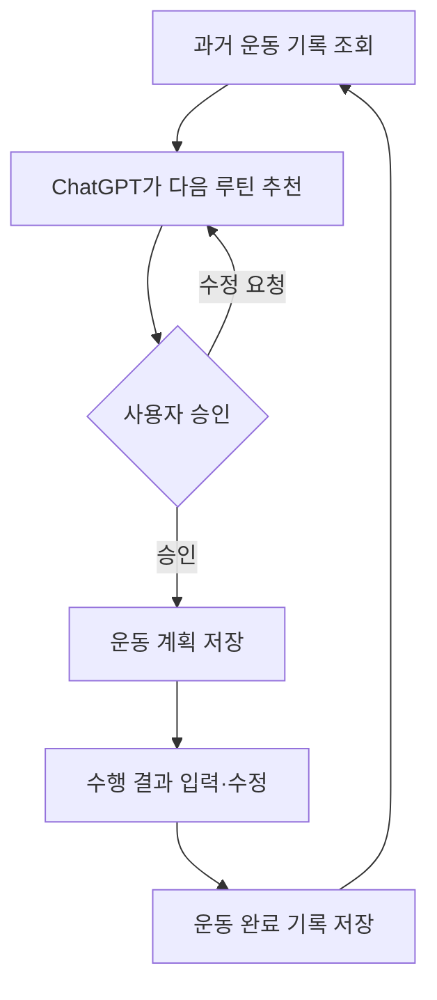

# FitLog GPT 연동 운동 관리 시스템

## MCP 연동 PoC 성과 및 1차 마일스톤 보고서

- 작성일: 2026년 8월 11일
- 프로젝트 단계: MCP 연동 PoC 완료 / 실제 MVP 개발 전환점
- 프로젝트명: FitLog

---

## 1. 프로젝트 배경

기존에는 운동을 마친 뒤 수행 기록을 메모장에 직접 적고, 다음 운동 전에 과거 기록을 찾아 ChatGPT에 복사하여 루틴 추천을 받았다. 이 방식은 다음과 같은 불편함이 있었다.

- 운동할 때마다 과거 기록을 직접 찾아 ChatGPT에 전달해야 한다.
- ChatGPT가 제안한 루틴과 실제 수행 결과를 다시 수작업으로 정리해야 한다.
- 날짜별·운동 종목별 기록 조회가 어렵다.
- 장기간의 운동 기록을 ChatGPT의 대화 기억에만 의존할 수 없다.
- 기록이 구조화된 데이터가 아니므로 중량과 수행량의 변화를 분석하기 어렵다.

FitLog는 이러한 문제를 해결하기 위해, 운동 기록을 별도의 데이터 저장소에서 관리하고 ChatGPT가 필요한 기록을 도구를 통해 직접 조회·저장할 수 있도록 만드는 프로젝트다.

---

## 2. 이번 PoC의 목적

이번 단계에서는 FitLog 전체 서비스를 구현하지 않고, 프로젝트에서 가장 불확실했던 다음 질문을 먼저 검증했다.

> ChatGPT가 사용자가 만든 외부 MCP 서버에 접속하여 운동 기록 조회 도구를 발견하고 실제로 실행할 수 있는가?

이를 확인하기 위해 기능 범위를 최근 운동 기록을 반환하는 `get_recent_workouts` 도구 하나로 제한했다. 데이터베이스와 사용자 화면은 이번 검증 범위에 포함하지 않았다.

### 성공 기준

다음 조건을 모두 충족하면 PoC가 성공한 것으로 정의했다.

1. 로컬 PC에서 MCP 서버가 정상적으로 실행된다.
2. MCP 클라이언트의 초기화 요청에 서버가 응답한다.
3. ChatGPT가 서버의 `get_recent_workouts` 도구를 발견한다.
4. ChatGPT가 해당 도구를 직접 호출한다.
5. 최근 운동 기록 1개가 ChatGPT 대화에 반환된다.

---

## 3. 구현 범위와 기술 구성

### 구현한 기능

- Node.js 기반 MCP 서버
- Streamable HTTP 방식의 `/mcp` 엔드포인트
- 최근 운동 기록을 조회하는 `get_recent_workouts` 도구
- 조회 개수를 지정하는 `limit` 입력값
- ChatGPT가 해석할 수 있는 구조화된 운동 기록 응답
- Cloudflare Quick Tunnel을 이용한 임시 HTTPS 공개
- ChatGPT 맞춤형 플러그인 `FitLog PoC` 등록

### 기술 구성

| 구성 요소 | 역할 |
|---|---|
| Node.js | JavaScript로 작성된 MCP 서버 실행 환경 |
| npm | MCP SDK 등 의존성 설치 및 서버 실행 |
| MCP SDK | ChatGPT가 도구를 발견하고 호출할 수 있는 프로토콜 구현 |
| `server.js` | MCP 서버와 `get_recent_workouts` 도구 구현 |
| Cloudflare Quick Tunnel | 로컬 서버에 임시 공개 HTTPS 주소 제공 |
| ChatGPT 개발자 모드 | 맞춤형 MCP 서버를 플러그인으로 등록하고 호출 |

---

## 4. 시스템 연결 구조


ChatGPT는 사용자의 PC에 있는 `localhost` 주소에 직접 접근할 수 없다. 따라서 Cloudflare Quick Tunnel이 로컬 서버를 임시 HTTPS 주소로 공개하고, ChatGPT에는 그 주소의 `/mcp` 엔드포인트를 등록했다.

---

## 5. 진행 과정

### 5.1 MCP 서버 코드 준비

다음 핵심 파일로 실행 가능한 서버를 구성했다.

- `server.js`: MCP 서버와 도구 로직
- `package.json`: 실행 명령과 프로젝트 설정
- `package-lock.json`: 설치할 패키지 버전 고정
- `README.md`: 실행 방법과 프로젝트 설명

`get_recent_workouts`는 `limit` 값을 받아 최근 운동 기록을 반환하도록 구현했다. 이번 단계에서는 데이터베이스 대신 코드에 포함된 샘플 운동 기록을 사용했다.

### 5.2 로컬 프로토콜 검증

ChatGPT에 연결하기 전에 로컬 환경에서 다음 항목을 확인했다.

- 서버 상태 확인
- MCP `initialize` 요청 성공
- `tools/list`에서 `get_recent_workouts` 발견
- `get_recent_workouts(limit: 1)` 호출 성공
- 결과가 구조화된 응답으로 반환됨

이 검증을 통해 서버 코드와 MCP 프로토콜 처리가 정상임을 먼저 확인했다.

### 5.3 실행 환경 구성

사용자 PC에는 처음에 Node.js가 설치되어 있지 않아 `npm` 명령을 사용할 수 없었다. Node.js LTS를 설치한 뒤 `node --version`과 `npm --version`으로 설치를 확인했다.

VS Code의 PowerShell에서 실행 정책이 `npm.ps1`을 차단하는 문제가 있었지만, 시스템 보안 설정을 변경하지 않고 `npm.cmd`를 사용하여 해결했다.

```powershell
npm.cmd install
npm.cmd start
```

서버는 다음 로컬 엔드포인트에서 정상적으로 실행되었다.

```text
http://localhost:8787/mcp
```

### 5.4 로컬 서버의 HTTPS 공개

ChatGPT가 로컬 서버에 접근할 수 있도록 `cloudflared`를 설치하고 Quick Tunnel을 실행했다.

```powershell
cloudflared tunnel --url http://localhost:8787
```

이를 통해 `https://<임시주소>.trycloudflare.com/mcp` 형태의 공개 MCP 주소를 확보했다. Quick Tunnel 주소는 실행할 때마다 바뀔 수 있는 개발·검증용 임시 주소다.

### 5.5 ChatGPT 플러그인 등록

ChatGPT에서 개발자 모드를 활성화한 뒤 다음 정보로 맞춤형 플러그인을 등록했다.

- 이름: `FitLog PoC`
- 설명: 최근 운동 기록 조회 테스트
- 연결 방식: 서버 URL
- 서버 URL: Cloudflare Quick Tunnel 주소의 `/mcp` 엔드포인트
- 인증 방식: 인증 없음

등록 화면에서 `get_recent_workouts` 액션과 입력 스키마가 표시되었으며, 이를 통해 ChatGPT가 서버에 접속하여 도구 목록을 읽었음을 확인했다.

### 5.6 실제 ChatGPT 호출 검증

PC에서는 MCP 서버와 Cloudflare 터널을 실행하고, 휴대폰의 새 ChatGPT 대화에서는 `FitLog PoC` 플러그인을 활성화하여 다음 요청을 실행했다.

```text
FitLog PoC의 get_recent_workouts 도구를 사용해서
최근 운동 기록 1개를 조회해줘. 다른 도구는 사용하지 마.
```

ChatGPT가 `get_recent_workouts`를 호출하고 샘플 운동 기록 1개를 반환했다. 이로써 로컬 서버부터 ChatGPT 대화까지의 전체 연결이 정상적으로 동작함을 확인했다.

---

## 6. 최종 검증 결과

| 검증 항목 | 결과 |
|---|---|
| Node.js MCP 서버 실행 | 성공 |
| MCP 초기화 | 성공 |
| 도구 목록 조회 | 성공 |
| `get_recent_workouts(limit: 1)` 로컬 호출 | 성공 |
| Cloudflare HTTPS 터널 연결 | 성공 |
| ChatGPT 플러그인 등록 | 성공 |
| ChatGPT의 도구 발견 | 성공 |
| 휴대폰 ChatGPT에서 실제 도구 호출 | 성공 |
| 운동 기록 1개 반환 | 성공 |

### 검증된 전체 흐름

> 휴대폰 ChatGPT → FitLog PoC 플러그인 → Cloudflare 터널 → PC의 MCP 서버 → `get_recent_workouts` 실행 → 운동 기록 반환

이번 PoC를 통해 FitLog의 핵심 전제인 **“ChatGPT가 별도의 운동 기록 시스템을 도구로 사용할 수 있다”**는 사실을 실제 환경에서 검증했다.

---

## 7. 진행 중 해결한 문제

| 문제 | 원인 | 해결 |
|---|---|---|
| `npm` 명령을 인식하지 못함 | Node.js 미설치 | Node.js LTS 설치 후 버전 확인 |
| PowerShell에서 `npm.ps1` 실행 차단 | PowerShell 실행 정책 | 설정 변경 없이 `npm.cmd` 사용 |
| `cloudflared` 명령을 인식하지 못함 | 설치 직후 VS Code가 이전 PATH 유지 | VS Code 전체 재시작 후 확인 |
| 브라우저에 `127.0.0.1:5500` 파일 목록 표시 | VS Code Live Server가 별도로 실행됨 | MCP 서버와 무관함을 확인하고 Live Server 종료 |
| 처음 연 채팅에서 FitLog 도구를 사용할 수 없음 | 해당 대화에 플러그인이 활성화되지 않음 | 새 일반 채팅에서 `플러그인 → FitLog PoC` 선택 |
| PC 작업과 ChatGPT 호출을 동시에 확인하기 어려움 | 한 화면에서 서버 운영과 호출 테스트 병행 | PC는 개발·서버 운영, 휴대폰은 플러그인 호출 테스트로 역할 분리 |

---

## 8. 이번 성과의 의미

이번 결과는 단순히 서버가 실행된 것에 그치지 않는다. 다음과 같은 프로젝트 핵심 위험을 줄였다.

1. **MCP 연동 가능성 확인**  
   ChatGPT가 직접 만든 외부 서버의 도구를 실제로 호출할 수 있음을 검증했다.

2. **전체 통신 경로 확인**  
   ChatGPT, 공개 HTTPS 주소, 로컬 MCP 서버 사이의 통신이 실제 환경에서 작동했다.

3. **FitLog 핵심 구조의 타당성 확인**  
   운동 기록을 ChatGPT 대화 기억에만 맡기지 않고 외부 시스템에서 관리하는 구조가 기술적으로 가능하다는 근거를 확보했다.

4. **실제 MVP 개발의 출발점 확보**  
   이후에는 검증된 MCP 연결을 유지한 채 샘플 데이터 부분을 실제 데이터베이스 조회·저장 로직으로 교체할 수 있다.

5. **포트폴리오에 제시할 수 있는 구체적 결과 확보**  
   아이디어와 문서 설계를 넘어, ChatGPT에서 직접 실행되는 사용자 정의 도구를 구현하고 검증했다.

---

## 9. 현재 한계와 미구현 범위

PoC가 성공했지만 FitLog 서비스 전체가 완성된 것은 아니다.

- 반환된 운동 기록은 실제 DB 데이터가 아니라 `server.js`의 샘플 데이터다.
- 최근 운동 기록 조회 기능 하나만 구현되어 있다.
- 운동 계획 저장, 수행 결과 수정, 완료 처리 기능은 아직 없다.
- 사용자별 데이터 분리와 인증이 구현되지 않았다.
- Cloudflare Quick Tunnel은 임시 주소이므로 항상 사용할 수 있는 배포 환경이 아니다.
- FitLog 웹 화면은 이번 PoC 범위에 포함되지 않았다.
- 오류 처리, 입력 검증, 운영 보안, 로그 관리가 아직 최소 수준이다.

따라서 현재 상태는 **MCP 기술 검증 완료**이며, **실사용 가능한 MVP 완성**과는 구분해야 한다.

---

## 10. 다음 단계: 실제 MVP 개발

PoC 다음 단계에서는 샘플 데이터를 실제 데이터베이스로 교체하고 최소한의 운동 관리 흐름을 완성한다.

### 우선 구현 범위

1. 실제 운동 기록 저장
2. 최근 운동 기록 조회
3. 날짜별·운동 종목별 기록 조회
4. ChatGPT가 추천한 운동 계획 저장
5. 사용자가 수행 결과를 수정하고 완료 처리
6. 완료된 기록을 다음 대화에서 다시 조회

### 목표 사용자 흐름



이 흐름이 완성되면 사용자가 과거 기록을 직접 복사해 전달하지 않아도 ChatGPT가 FitLog의 구조화된 데이터를 바탕으로 루틴을 추천하고, 승인된 계획과 실제 수행 결과를 다시 저장할 수 있다.

---

## 11. 마일스톤 결론

2026년 8월 11일, FitLog 프로젝트는 첫 번째 핵심 마일스톤에 도달했다.

> 자체 구현한 Node.js MCP 서버를 ChatGPT에 연결하고, `get_recent_workouts` 도구를 통해 최근 운동 기록 1개를 실제 대화에서 조회하는 데 성공했다.

가장 불확실했던 외부 MCP 연동 가능성을 검증했으므로, 프로젝트는 이제 기술 실험 단계에서 실제 데이터베이스 기반 MVP 개발 단계로 전환할 수 있다.

