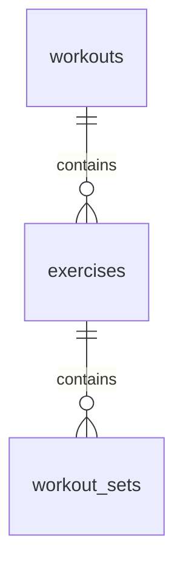
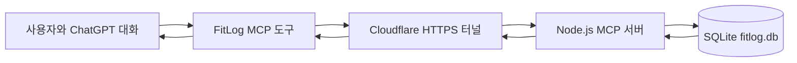

# FitLog GPT 연동 운동 관리 시스템

## SQLite 양방향 MCP 연동 및 2차 마일스톤 보고서

- 작성일: 2026년 10월 2일
- 프로젝트 단계: MCP PoC에서 동작 가능한 핵심 MVP로 전환
- 프로젝트명: FitLog

---

## 1. 이번 마일스톤의 목표

1차 마일스톤에서는 ChatGPT가 외부 MCP 서버의 조회 도구를 발견하고 호출할 수 있는지를 검증했다. 이번 단계에서는 검증된 연결 구조를 실제 데이터베이스와 연결하여 다음 질문을 확인했다.

> ChatGPT가 SQLite에 저장된 운동 기록을 조회하고, 사용자가 전달한 새로운 운동 기록을 다시 SQLite에 저장할 수 있는가?

이를 위해 기존 `get_recent_workouts`를 실제 DB 조회 방식으로 변경하고, 쓰기 도구인 `save_workout`을 추가했다.

### 성공 기준

1. SQLite에서 최근 운동 기록을 조회한다.
2. 조회 결과를 운동 → 종목 → 세트 구조로 반환한다.
3. 새로운 운동 기록을 하나의 트랜잭션으로 저장한다.
4. 로컬 MCP 클라이언트에서 저장과 조회를 검증한다.
5. ChatGPT가 조회·저장 도구를 모두 발견한다.
6. ChatGPT에서 저장한 기록을 다시 조회한다.

---

## 2. 구현한 기능

- SQLite 데이터베이스 `database/fitlog.db` 구축
- DB 초기화를 위한 `database/init-db.js` 작성
- 개발·테스트 데이터 입력을 위한 `database/seed-db.js` 작성
- `workouts`, `exercises`, `workout_sets` 테이블 구성
- SQL JOIN을 이용한 최근 운동 기록 조회
- 조회 결과를 운동 → 종목 → 세트 구조의 JSON으로 변환
- 새로운 운동 기록을 저장하는 `save_workout` MCP 도구 구현
- UUID를 이용한 운동 세션 식별자 생성
- 트랜잭션을 이용한 운동·종목·세트의 일괄 저장
- 로컬 MCP 클라이언트를 이용한 저장 및 재조회 검증
- Cloudflare Quick Tunnel을 통한 ChatGPT 실제 호출 검증

---

## 3. 데이터 저장 구조

| 테이블 | 역할 | 주요 데이터 |
|---|---|---|
| `workouts` | 한 번의 운동 세션 | 운동 ID, 완료 시각 |
| `exercises` | 운동 세션에 포함된 종목 | 종목명, 종목 순서 |
| `workout_sets` | 각 종목에서 수행한 세트 | 세트 번호, 중량, 반복 횟수 |

운동 한 번에 여러 종목이 포함되고, 각 종목에 여러 세트가 포함되는 계층 구조를 관계형 테이블로 분리했다.



---

## 4. 핵심 구현

### 4.1 실제 DB 조회

`get_recent_workouts`는 SQLite의 세 테이블을 JOIN하여 최근 운동 기록을 조회한다. SQL 결과는 행 단위로 반환되므로 JavaScript의 `Map`을 이용해 다음과 같은 중첩 구조로 변환한다.

```text
운동 세션
└─ 운동 종목
   └─ 세트별 중량·반복 횟수
```

### 4.2 운동 기록 저장

`save_workout`은 완료 시각과 운동 종목 배열을 입력받는다. 각 종목에는 하나 이상의 세트가 포함되며, 세트별 중량과 반복 횟수를 저장한다. 저장이 성공하면 생성된 운동 ID를 반환한다.

### 4.3 저장 트랜잭션

`saveWorkout()` 함수는 다음 순서로 데이터를 저장한다.

```text
BEGIN
→ workouts에 운동 세션 저장
→ exercises에 종목을 순서대로 저장
→ workout_sets에 세트별 중량과 반복 횟수 저장
→ 모든 작업 성공 시 COMMIT
→ 오류 발생 시 ROLLBACK
```

운동 세션, 종목 또는 세트 중 하나라도 저장에 실패하면 전체 작업을 취소하도록 구성했다. 이를 통해 일부 데이터만 저장되어 운동 기록이 불완전해지는 문제를 방지했다.

---

## 5. MCP 도구 구성

| 도구 | 역할 | 데이터 변경 여부 |
|---|---|---|
| `get_recent_workouts` | 최근 완료한 운동 기록 조회 | 없음 |
| `save_workout` | 완료한 운동의 종목과 세트 기록 저장 | 있음 |

두 도구는 Zod 스키마를 이용해 입력과 출력 구조를 정의했다. `get_recent_workouts`는 읽기 전용 도구로, `save_workout`은 새로운 데이터를 생성하는 쓰기 도구로 구분했다.

---

## 6. 검증 과정과 결과

### 6.1 로컬 검증

Node.js MCP 서버를 실행한 뒤 `test-client.js`에서 도구를 호출했다.

```text
save_workout 호출
→ SQLite 저장
→ get_recent_workouts 호출
→ 방금 저장한 운동 기록 확인
```

### 6.2 ChatGPT 실제 호출 검증

Cloudflare Quick Tunnel로 로컬 서버의 `/mcp` 엔드포인트를 임시 HTTPS 주소에 공개했다. ChatGPT에 해당 서버를 등록한 뒤 다음 항목을 확인했다.

- `get_recent_workouts`와 `save_workout` 도구 발견
- SQLite에 저장된 기존 운동 기록 조회
- 대화로 전달한 테스트 운동 기록 저장
- 가장 최근 운동 기록 재조회

### 6.3 최종 결과

| 검증 항목 | 결과 |
|---|---|
| SQLite DB 및 테이블 생성 | 성공 |
| 시드 데이터 입력 | 성공 |
| `get_recent_workouts`의 실제 DB 조회 | 성공 |
| 로컬 클라이언트에서 `save_workout` 호출 | 성공 |
| 저장 직후 `get_recent_workouts` 재조회 | 성공 |
| Cloudflare HTTPS 터널 연결 | 성공 |
| ChatGPT의 두 MCP 도구 발견 | 성공 |
| ChatGPT에서 실제 운동 기록 조회 | 성공 |
| ChatGPT에서 운동 기록 저장 및 재조회 | 성공 |

---

## 7. 현재 시스템 구조



이번 검증으로 다음 양방향 흐름이 모두 동작함을 확인했다.

```text
ChatGPT → get_recent_workouts → SQLite 조회 → 운동 기록 반환
ChatGPT → save_workout → SQLite 저장 → 생성된 운동 ID 반환
```

---

## 8. 진행 중 해결한 문제

| 문제 | 원인 | 해결 |
|---|---|---|
| 프로젝트 최상위에서 `npm start` 실패 | `package.json`이 `mcp-server` 폴더에 존재 | `mcp-server`로 이동한 뒤 `npm.cmd start` 실행 |
| `save_workout is already registered` 오류 | 동일한 도구 등록 코드가 중복 추가됨 | 중복 `registerTool` 블록을 제거하고 하나만 유지 |
| `get_recent_workouts not found` 오류 | 중복 코드를 정리하는 과정에서 조회 도구 등록 블록도 삭제됨 | 조회 도구 등록 코드를 복구하고 두 도구의 등록 순서 확인 |
| 테스트 실행 시 중복 운동 기록 생성 | 저장과 조회를 함께 수행하는 테스트를 반복 실행 | 기본 테스트 클라이언트를 조회 전용으로 되돌리고 테스트 DB 복구 |
| 임시 공개 주소가 재실행 때 변경됨 | Cloudflare Quick Tunnel의 특성 | 테스트할 때마다 새 주소를 ChatGPT MCP 설정에 반영 |

---

## 9. 이번 성과의 의미

1차 마일스톤이 MCP 연결 가능성을 확인한 기술 검증이었다면, 이번 단계에서는 실제 운동 데이터의 조회와 저장까지 연결했다. 따라서 FitLog는 단순한 샘플 MCP 서버를 넘어 다음 핵심 사용자 흐름을 수행할 수 있는 상태가 되었다.

1. ChatGPT가 과거 운동 기록을 조회한다.
2. 조회한 기록을 바탕으로 운동 관련 답변을 제공한다.
3. 사용자가 완료한 운동 기록을 ChatGPT에 전달한다.
4. ChatGPT가 해당 기록을 SQLite에 저장한다.
5. 이후 대화에서 저장된 기록을 다시 조회한다.

이번 마일스톤을 통해 FitLog의 핵심 가치인 **“ChatGPT가 실제 운동 기록 저장소를 직접 읽고 쓰는 구조”**를 구현하고 실제 환경에서 검증했다.

---

## 10. 현재 한계와 다음 단계

- Cloudflare Quick Tunnel은 임시 테스트 방식이므로 운영용 고정 배포와 인증이 필요하다.
- 사용자별 데이터 분리와 접근 제어가 구현되지 않았다.
- 날짜별·종목별 상세 조회 및 기록 수정·삭제 기능이 없다.
- 동일한 완료 시각을 가진 기록의 정렬 기준을 보완해야 한다.
- 웹 기반 운동 기록 조회·입력 화면이 아직 없다.
- 루트 `README.md`와 실행 화면 중심의 포트폴리오 문서가 필요하다.

앞으로 약 2주 동안 기능을 과도하게 확장하기보다 다음 항목을 우선한다.

1. 핵심 MVP 범위 확정 및 오류 처리 보완
2. 간단한 FitLog 웹 화면 구현
3. 재현 가능한 설치·실행 절차 정리
4. 시스템 구조도와 실제 실행 화면 준비
5. 다전공 지원용 GitHub README 완성
