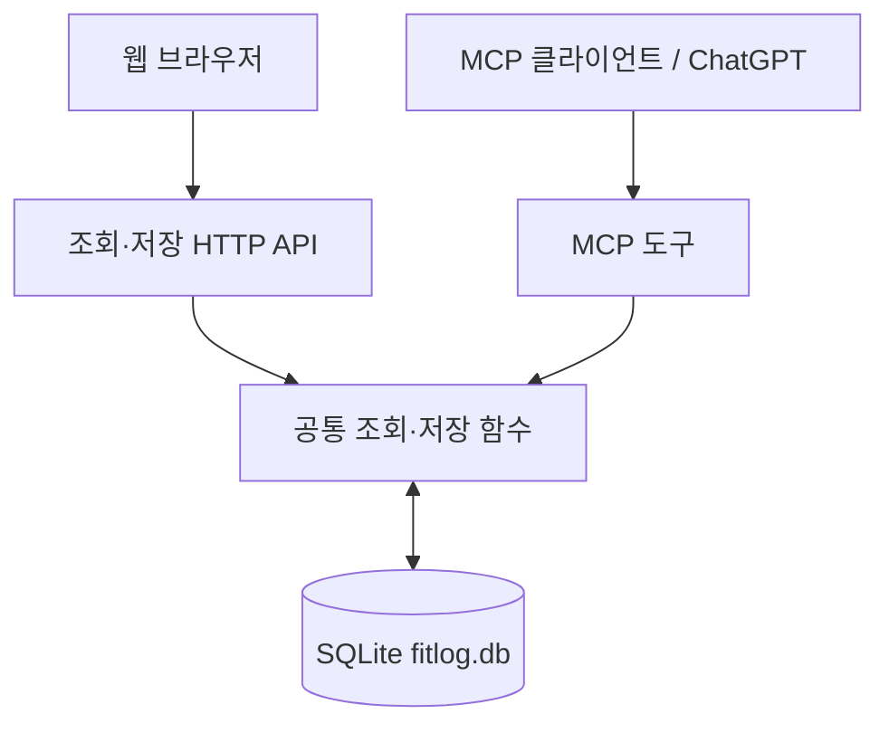

# FitLog 웹 조회·입력 및 3차 마일스톤 보고서

- 작업 기간: 2026년 10월 2일 밤 ~ 10월 3일 새벽 (한국 시간)
- 작성일: 2026년 10월 3일
- 단계: 로컬 웹 화면과 MCP의 공유 DB 연동 검증

## 1. 목표

2차 마일스톤에서 구축한 SQLite 조회·저장 함수를 웹에서도 사용할 수 있도록 확장했다. 첫 목표는 브라우저에서 운동 기록을 조회하는 것이었으며, 남은 시간에 종목 하나의 여러 세트를 입력하는 기능까지 구현했다.

## 2. 구현 범위

| 파일 | 역할 |
|---|---|
| `app/index.html` | 운동 기록 목록과 입력 폼 |
| `app/styles.css` | 카드·표·입력 폼 및 좁은 화면용 스타일 |
| `app/app.js` | API 호출, 기록 표시, 세트 추가·제거, 저장 후 목록 갱신 |
| `mcp-server/server.js` | 기존 MCP 처리 유지, 웹 파일 제공과 HTTP API 추가 |

| 요청 | 기능 |
|---|---|
| `GET /` | 웹 화면 제공 |
| `GET /api/workouts?limit=10` | 최근 운동 기록 조회 |
| `POST /api/workouts` | 완료 시각·종목·세트 저장 |
| `/mcp` | 기존 MCP 도구 통신 |

웹 입력은 종목 하나에 여러 세트를 입력하는 범위로 제한했다. 완료 시각은 한국 시간으로 입력하고 시간대 정보와 함께 전송하며, 목록에서도 한국 시간으로 표시한다.

## 3. 설계 선택

웹 API는 기존 `getRecentWorkouts()`와 `saveWorkout()`을 재사용한다. 웹과 MCP가 별도 저장 로직을 갖지 않고 같은 SQLite DB를 읽고 쓰도록 구성했다. 저장 함수의 트랜잭션 처리도 그대로 사용한다.



외부 프런트엔드 라이브러리 없이 HTML·CSS·JavaScript로 구성했다. 같은 서버에서 화면과 API를 제공하므로 로컬 개발 시 별도 웹 서버가 필요하지 않다. DB에서 받은 종목명은 `textContent`로 표시한다.

## 4. 입력 및 오류 처리

- 조회 개수는 1~20 사이 정수로 제한한다.
- 저장 요청은 JSON 파싱과 Zod 스키마 검사를 거친다.
- 빈 종목명, 음수 중량, 1 미만 또는 정수가 아닌 반복 횟수를 거부하도록 구현했다.
- 요청 본문 크기는 64KB로 제한한다.
- 폼에 최소 한 세트를 유지하고, 저장 중에는 저장 버튼을 비활성화한다.
- 저장 성공 시 폼을 초기화하고 목록을 다시 조회한다.
- 조회 실패와 저장 실패 메시지를 화면에 표시한다.

위 항목은 구현한 처리 범위이며, 모든 실패 조건을 별도로 테스트한 것은 아니다. 서버 차원의 중복 저장 방지는 아직 구현하지 않았다.

## 5. 실제 검증 결과

| 검증 | 확인 결과 |
|---|---|
| HTTP API로 SQLite 조회 | 시드 운동 기록 JSON 반환 |
| 브라우저 목록 표시 | 한국 시간 날짜와 Chest Press 25kg, 10/9/8회 표시 |
| 잘못된 조회 개수 | `limit=0` 요청에 입력 오류 메시지 표시 |
| 기존 MCP 조회 유지 | 기존 시드 기록 정상 반환 |
| 웹 폼 저장·목록 갱신 | 사용자 확인 완료 |
| 웹 저장 후 MCP 조회 | 아래 벤치 프레스 기록 반환 |

공유 DB 검증에서 MCP 클라이언트가 반환한 기록:

- 운동 ID: `e0428683-58de-4179-afbc-78c18e468b91`
- 완료 시각: `2026-10-03T00:25:00+09:00`
- 종목: 벤치 프레스
- 1세트: 40kg, 8회
- 2세트: 40kg, 8회

이번 세션의 교차 검증은 로컬 `test-client.js`를 사용했다. ChatGPT 외부 연결은 2차 마일스톤에서 검증했으며, 이번 웹 기능 추가 후 다시 외부 호출한 것으로 기록하지 않는다.

## 6. 해결한 문제

| 증상 | 확인된 내용 및 조치 |
|---|---|
| API 추가 직후 404 | 파일 저장·서버 재시작 후 정상 응답 확인 |
| 화면은 열리지만 운동 기록 로딩 실패 | 브라우저 콘솔에서 API 404 확인. 요청 처리 코드에 API 블록이 빠진 것을 확인하고 복구 |
| 예전 루트 텍스트 응답 블록 잔존 | 해당 블록을 API 처리 코드로 교체하고 웹 파일 제공 유지 |

## 7. 로컬 실행

Node.js와 의존성, DB가 준비된 기존 프로젝트의 최상위 폴더에서 실행한다.

```powershell
npm.cmd --prefix .\mcp-server start
```

브라우저에서 `http://localhost:8787`을 연다. 별도 터미널에서는 다음 명령으로 MCP 조회를 확인한다.

```powershell
node .\mcp-server\test-client.js
```

서버 코드를 수정하면 서버 재시작이 필요하다. 현재 정적 파일 제공 방식에서는 HTML·CSS·JavaScript 변경 후 브라우저를 새로고침하면 된다. 위 절차는 최초 설치 가이드가 아니라 기존 개발 환경에서의 실행 절차다.

## 8. 현재 한계와 다음 단계

- 웹 폼은 운동 세션당 종목 하나만 입력한다.
- 기록 수정·삭제, 날짜별·종목별 검색은 미구현이다.
- 로컬 단일 사용자 시제품이며, 인증·접근 제어와 운영 배포는 미구현이다.
- 날짜의 엄격한 유효성 검사, 시간대 정규화, 동일 시각 정렬을 보완해야 한다.
- 중복 요청 방지와 트랜잭션 실패 시 롤백 검증은 후속 작업이다.
- 빈 목록 및 모든 오류 상태, 모바일 실제 사용성은 추가 확인이 필요하다.
- DB 파일은 현재 Git 추적 대상이다. 실제 기록을 보존하면서 DB를 추적에서 제외하고 초기화·시드 스크립트로 재현하는 방식으로 개선할 예정이다.

다음 작업에서는 다중 종목 입력 등 필요한 MVP 범위를 정리하고, README와 실행 화면을 통해 설치 방법과 검증된 동작을 설명한다. 이번 성과는 웹 조회·입력과 MCP가 같은 저장소를 공유하는 로컬 동작 검증이며, 운영용 서비스 완성과는 구분한다.
