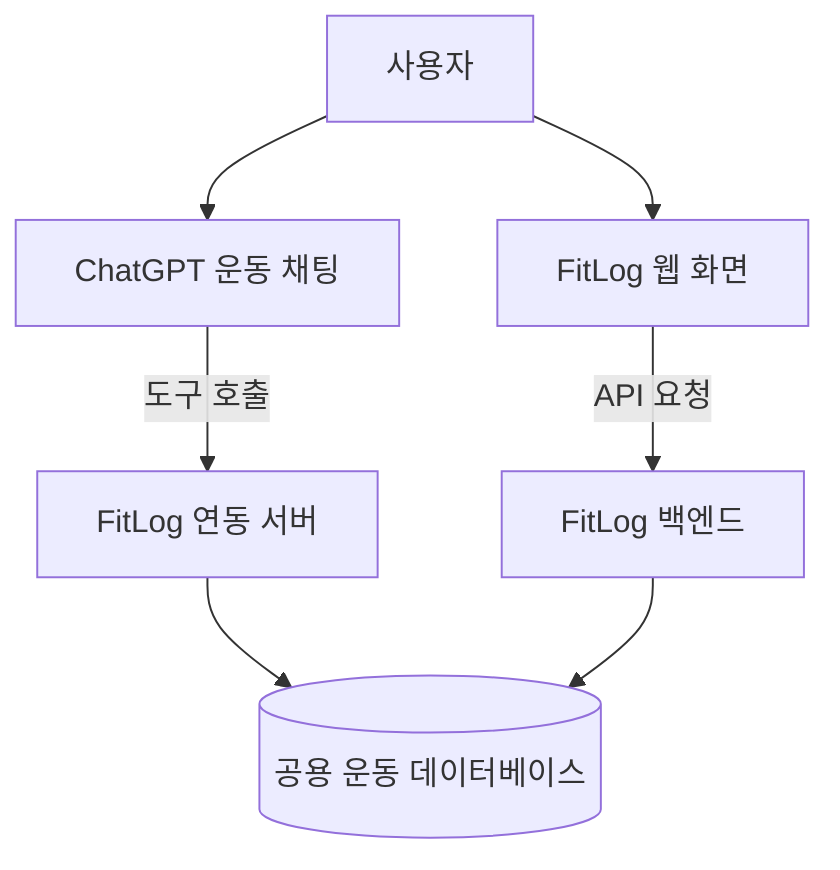

# GPT 연동 운동 관리 시스템 기획

## 1. 프로젝트를 시작한 계기

올해 헬스를 시작하면서 PT를 받고 싶었지만, 비용 부담 때문에 ChatGPT를 개인 운동 코치처럼 활용하기 시작했다. 이전 운동 기록을 전달하면 GPT가 운동 공백과 수행 결과를 고려해 다음 운동의 중량과 반복 횟수를 조정해 주었다.

예를 들어 다음과 같이 이전 운동 기록을 입력하면,

```text
4/16 운동 기록

워밍업
러닝 3분

Chest Press
35kg
8 / 7 / 7 / 6

Assist Pull-up
35kg 보조
8 / 8 / 7 / 6

Leg Press
80kg
10 / 10 / 10 / 10
```

ChatGPT는 이전 수행 기록과 세트별 반복 횟수를 참고하여 다음 운동 루틴을 제안할 수 있었다.

하지만 이 방식에는 다음과 같은 불편함이 있었다.

* 운동할 때마다 이전 기록을 메모장에서 찾아 GPT에 다시 입력해야 했다.
* GPT가 제안한 루틴을 운동 기록장에 다시 옮겨 적어야 했다.
* 실제 수행 결과가 계획과 달라지면 기록을 직접 수정해야 했다.
* 운동이 끝난 뒤 실제 수행 결과를 다시 GPT에 전달해야 했다.
* 기록이 여러 메모와 대화에 흩어져 날짜별 또는 운동별로 조회하기 어려웠다.
* ChatGPT가 장기간의 운동 기록을 항상 정확하게 기억한다고 보장할 수 없었다.
* 계획한 운동과 실제 수행한 운동의 차이를 구조적으로 비교하기 어려웠다.

이러한 문제를 해결하기 위해 ChatGPT와 운동 기록 애플리케이션이 하나의 데이터를 공유하는 운동 관리 시스템을 구상하게 되었다.

---

## 2. 프로토타입 `FitLog` 제작

처음에는 ChatGPT의 웹 제작 기능을 이용해 운동 기록용 프로토타입 사이트인 `FitLog`를 만들었다.

FitLog를 사용하면 운동 도중 각 세트의 중량과 반복 횟수를 비교적 편하게 기록하고, 운동 데이터를 일정한 형식으로 저장할 수 있었다.

그러나 FitLog와 ChatGPT는 서로 연결되어 있지 않았다.

* GPT가 추천한 루틴을 FitLog에 직접 입력해야 했다.
* FitLog에 저장된 기록을 GPT가 조회할 수 없었다.
* 실제 수행 결과를 다시 GPT에게 전달해야 했다.
* GPT의 운동 추천과 FitLog의 운동 기록이 하나의 과정으로 이어지지 않았다.

이 과정을 통해 내가 원하는 것은 단순한 운동 기록 웹사이트가 아니라는 것을 알게 되었다.

또한 소프트웨어융합학과 다전공을 목표로 하는 입장에서, AI가 완성된 결과물을 한 번에 생성하도록 하기보다 요구사항 정의, 시스템 설계, 데이터베이스 구성과 구현 과정에 직접 참여해 보고 싶었다.

따라서 기존 FitLog는 아이디어를 검증한 프로토타입으로 두고, ChatGPT와 운동 기록이 연결되는 새로운 시스템을 직접 개발하기로 결정했다.

---

## 3. 프로젝트의 목표

이 프로젝트의 목표는 ChatGPT와 FitLog가 동일한 운동 데이터를 사용하도록 만들어, 운동 루틴의 추천과 실제 수행 기록이 양방향으로 연결되는 개인 운동 관리 시스템을 구현하는 것이다.

전체 흐름은 다음과 같다.

```text
사용자가 ChatGPT에 오늘의 운동을 요청한다.
        ↓
ChatGPT가 데이터베이스에 저장된 최근 운동 기록을 조회한다.
        ↓
필요한 경우 운동 시간, 통증, 컨디션 등을 질문한다.
        ↓
ChatGPT가 오늘의 운동 루틴을 제안한다.
        ↓
사용자가 루틴을 수정하거나 동의한다.
        ↓
동의한 최종 루틴이 FitLog에 생성된다.
        ↓
사용자가 FitLog를 보며 운동을 진행한다.
        ↓
계획과 달라진 중량이나 횟수만 수정한다.
        ↓
완료된 실제 운동 결과가 데이터베이스에 저장된다.
        ↓
ChatGPT가 최신 운동 결과를 다음 추천에 활용한다.
```

이 시스템의 핵심은 다음과 같다.

> GPT가 만든 계획을 사용자가 다시 FitLog에 옮겨 적지 않고, FitLog에서 작성한 실제 기록도 GPT에게 다시 전달하지 않도록 한다.

---

## 4. 핵심 구현 사항

### 4.1 최근 운동 기록 조회

사용자가 오늘의 운동을 요청하면 ChatGPT는 먼저 저장된 최근 운동 기록을 조회한다.

조회하는 정보에는 다음 내용이 포함될 수 있다.

* 마지막 운동 날짜
* 최근 수행한 운동 종목
* 세트별 중량과 반복 횟수
* 세트 완료 여부
* 운동별 체감 난이도
* 계획한 기록과 실제 수행 결과

ChatGPT는 기본적으로 기존 기록을 먼저 사용하고, 정확한 추천을 위해 추가 정보가 필요한 경우에만 사용자에게 질문한다.

예를 들어 다음 상황에서는 추가 질문이 필요할 수 있다.

* 마지막 운동 이후 공백이 긴 경우
* 통증이나 부상 여부를 확인해야 하는 경우
* 오늘 운동 가능한 시간이 필요한 경우
* 최근 수행 능력이 크게 감소한 경우
* 평소와 다른 목표나 운동 기구를 사용하는 경우

---

### 4.2 운동 루틴 제안

ChatGPT는 최근 운동 기록과 사용자의 현재 상태를 바탕으로 오늘의 운동 루틴을 제안한다.

제안에는 다음 정보가 포함된다.

* 운동 순서
* 운동 종목
* 세트 수
* 각 세트의 중량
* 각 세트의 목표 반복 횟수
* 필요한 경우 간단한 주의사항

예시:

```text
오늘 운동 루틴

1. Chest Press
25kg × 8회 × 3세트

2. Assist Pull-up
45kg 보조 × 8회 × 3세트

3. Leg Press
60kg × 10회 × 3세트
```

이 단계의 루틴은 아직 확정된 운동 계획이 아니다. 사용자는 GPT와 대화하면서 운동 종목, 순서, 중량 또는 세트 수를 변경할 수 있다.

---

### 4.3 사용자 동의 후 계획 생성

GPT가 루틴을 제안했다는 이유만으로 운동 계획을 바로 저장하지 않는다.

저장 과정은 다음 순서를 따른다.

```text
GPT가 루틴 초안을 제안한다.
        ↓
사용자가 루틴을 검토한다.
        ↓
필요한 내용을 수정한다.
        ↓
사용자가 최종 루틴에 동의한다.
        ↓
동의한 계획만 FitLog에 생성한다.
```

사용자 동의 전에는 다음 작업을 수행하지 않는다.

* 확정된 운동 세션 생성
* FitLog 운동 목록에 계획 표시
* 새로운 운동 종목 자동 생성
* 실제 운동 계획 데이터 저장

추천과 저장을 분리하여 사용자가 원하지 않은 루틴이 기록되는 것을 방지한다.

---

### 4.4 FitLog에 확정된 운동 계획 표시

사용자가 동의한 최종 루틴은 FitLog 화면에 나타난다.

FitLog에는 다음 정보가 표시된다.

* 운동 순서
* 운동 종목
* 계획 세트 수
* 세트별 계획 중량
* 세트별 계획 횟수

사용자는 FitLog에서 계획을 확인한 뒤 운동을 시작할 수 있다.

---

### 4.5 계획값을 실제 기록에 미리 입력

운동을 시작하면 계획 중량과 반복 횟수를 실제 수행 기록란에 미리 입력한다.

예를 들어 계획이 다음과 같다면,

```text
Chest Press
25kg × 8회 × 3세트
```

실제 기록란은 다음과 같이 시작한다.

```text
1세트: 25kg × 8회
2세트: 25kg × 8회
3세트: 25kg × 8회
```

계획대로 수행했다면 사용자는 세트 완료 버튼만 누르면 된다.

계획과 실제 결과가 다른 경우에만 값을 수정한다.

```text
계획: 25kg × 8회
실제: 25kg × 7회
```

이 경우 사용자는 횟수만 `8 → 7`로 변경한 뒤 세트를 완료한다.

핵심 원칙은 다음과 같다.

> 계획대로 수행했다면 완료만 누르고, 계획과 달라진 값만 수정한다.

---

### 4.6 운동 중 세트와 운동 추가

실제 운동은 계획과 다르게 진행될 수 있다.

사용자는 운동 중 다음 작업을 할 수 있어야 한다.

* 계획보다 세트를 추가한다.
* 계획한 세트를 수행하지 않는다.
* 세트의 중량이나 횟수를 변경한다.
* 계획에 없던 운동을 추가한다.
* 새로운 운동 종목을 생성한다.

계획에 없던 세트나 운동은 실제 수행 기록에만 추가하며, 원래 계획은 변경하지 않는다.

이를 통해 GPT가 제안한 계획과 사용자가 실제로 수행한 결과를 비교할 수 있다.

---

### 4.7 계획과 실제 수행 기록 분리

FitLog는 GPT가 제안하고 사용자가 동의한 계획과 실제 수행 결과를 별도로 저장한다.

| 세트  | 계획        | 실제        |
| --- | --------- | --------- |
| 1세트 | 25kg × 8회 | 25kg × 8회 |
| 2세트 | 25kg × 8회 | 25kg × 7회 |
| 3세트 | 25kg × 8회 | 20kg × 9회 |
| 4세트 | 없음        | 20kg × 8회 |

운동 시작 전 수정은 계획을 변경하는 것으로 처리하고, 운동 시작 후 수정은 실제 수행 결과로 기록한다.

이 구조를 사용하면 다음 내용을 확인할 수 있다.

* GPT가 제안한 중량이 적절했는가
* 계획한 반복 횟수를 달성했는가
* 어느 세트부터 수행 능력이 감소했는가
* 계획보다 세트나 운동을 추가했는가
* GPT의 추천과 실제 수행 사이에 어떤 차이가 있었는가

---

### 4.8 체감 난이도 기록

중량과 반복 횟수만으로는 운동이 얼마나 힘들었는지 판단하기 어렵다.

따라서 하나의 운동 종목을 마친 뒤 체감 난이도를 선택적으로 기록할 수 있게 한다.

| 표시      | 의미               |
| ------- | ---------------- |
| 쉬움      | 충분한 여유가 있었음      |
| 적당함     | 계획에 적절한 난이도였음    |
| 힘듦      | 수행은 가능했지만 부담이 컸음 |
| 한계에 가까움 | 추가 반복이 거의 불가능했음  |

체감 난이도는 모든 세트마다 입력하지 않고, 하나의 운동 종목을 마친 뒤 한 번만 입력한다.

이 정보는 다음 운동의 중량과 반복 횟수를 결정하는 참고 자료로 사용한다.

---

### 4.9 운동 완료 및 결과 저장

사용자가 운동 완료를 선택하면 실제 수행 결과가 확정된다.

저장되는 주요 정보는 다음과 같다.

* 운동 날짜
* 수행한 운동 종목
* 운동 순서
* 실제 세트 수
* 세트별 실제 중량
* 세트별 실제 반복 횟수
* 세트 완료 여부
* 운동별 체감 난이도
* 운동 완료 시각

완료된 운동은 ChatGPT가 조회할 수 있는 최신 기록이 된다.

---

### 4.10 완료 기록을 다음 운동에 활용

다음 운동에서 사용자가 다시 루틴을 요청하면 ChatGPT는 완료된 최신 기록을 조회한다.

예를 들어 이전 계획과 실제 결과가 다음과 같다면,

```text
계획
Chest Press 25kg × 8회 × 3세트

실제
1세트: 25kg × 8회
2세트: 25kg × 7회
3세트: 20kg × 9회
체감 난이도: 힘듦
```

GPT는 단순히 계획했던 `25kg × 8회 × 3세트`만 보는 것이 아니라 실제 수행 결과와 체감 난이도를 참고하여 다음 루틴을 제안한다.

이를 통해 운동 기록과 추천이 다음과 같은 순환 구조를 갖게 된다.

```text
최근 기록 조회
    ↓
운동 계획 제안
    ↓
사용자 동의
    ↓
FitLog에 계획 생성
    ↓
실제 운동 기록
    ↓
완료 결과 저장
    ↓
다음 운동 추천에 활용
```

---

## 5. 시스템 구성

FitLog 시스템은 다음 요소로 구성한다.



### ChatGPT

* 사용자의 운동 요청을 이해한다.
* 최근 운동 기록을 조회한다.
* 필요한 경우 추가 질문을 한다.
* 운동 루틴을 제안한다.
* 사용자의 동의를 확인한다.
* 동의한 계획을 생성하는 기능을 호출한다.
* 완료된 운동 기록을 다음 추천에 활용한다.

### FitLog 연동 서버

* ChatGPT가 사용할 수 있는 제한된 기능을 제공한다.
* 최근 운동 기록을 조회한다.
* 사용자가 동의한 운동 계획을 생성한다.
* 요청값과 사용자를 검증한다.
* ChatGPT가 데이터베이스에 직접 접근하지 못하도록 한다.

초기 기술 검증에서는 이 연동을 MCP 방식으로 구현한다.

### FitLog 웹 화면

* 확정된 운동 계획을 표시한다.
* 계획값을 실제 기록란에 미리 입력한다.
* 세트별 중량과 반복 횟수를 수정할 수 있게 한다.
* 세트와 운동을 추가할 수 있게 한다.
* 세트 완료 상태를 표시한다.
* 운동별 체감 난이도를 입력받는다.
* 운동 완료 기능을 제공한다.

### FitLog 백엔드

* 웹 화면의 요청을 처리한다.
* 운동 계획과 실제 기록을 저장한다.
* 사용자 인증과 입력값을 검증한다.
* 계획 기록과 실제 기록을 구분하여 관리한다.

### 공용 데이터베이스

* 운동 종목
* 운동 세션
* 계획 운동과 계획 세트
* 실제 수행 운동과 실제 수행 세트
* 운동별 체감 난이도

등의 데이터를 저장한다.

---

## 6. 첫 번째 MVP 범위

첫 번째 MVP는 다음 경험이 처음부터 끝까지 동작하는 것을 목표로 한다.

```text
사용자가 ChatGPT에 오늘 운동을 요청한다.
        ↓
ChatGPT가 최근 운동 기록을 조회한다.
        ↓
ChatGPT가 오늘의 운동 루틴을 제안한다.
        ↓
사용자가 루틴을 수정하거나 동의한다.
        ↓
동의한 계획이 FitLog에 생성된다.
        ↓
사용자가 계획과 달라진 값만 수정하며 운동한다.
        ↓
실제 수행 결과가 데이터베이스에 저장된다.
        ↓
ChatGPT가 완료 기록을 다음 운동에 활용한다.
```

MVP에 포함되는 기능은 다음과 같다.

* 최근 운동 기록 조회
* 기록을 바탕으로 한 루틴 제안
* 사용자 동의 확인
* 확정된 운동 계획 생성
* FitLog에 운동 계획 표시
* 계획값의 실제 기록 사전 입력
* 실제 중량과 반복 횟수 수정
* 세트 완료 처리
* 계획에 없던 세트 및 운동 추가
* 운동별 체감 난이도 선택 입력
* 운동 완료 처리
* 완료된 실제 기록 재조회
* 계획과 실제 기록의 분리 저장

다음 기능은 첫 번째 MVP에서 제외한다.

* 식단 및 영양 관리
* 체중과 체성분 관리
* 복잡한 통계 대시보드
* 운동 영상 분석
* 웨어러블 기기 연동
* 소셜 및 기록 공유 기능
* 횟수 범위 기반 계획
* 완전한 자동 증량 알고리즘
* 정교한 피로도 분석

---

## 7. 프로젝트의 성공 기준

이 프로젝트의 성공 기준은 기능을 많이 구현하는 것이 아니다.

다음 과정이 끊김 없이 동작하는 것이 가장 중요하다.

> 사용자가 ChatGPT에 오늘의 운동을 요청한다. ChatGPT는 실제 최근 기록을 조회해 루틴을 제안한다. 사용자가 동의하면 FitLog에 운동 계획이 생성된다. 사용자는 계획과 달라진 부분만 수정하며 운동을 진행한다. 완료된 실제 결과는 데이터베이스에 저장되고, ChatGPT는 다음 운동에서 그 기록을 다시 활용한다.

이 흐름이 안정적으로 동작한다면, FitLog의 핵심 가치인 **GPT와 운동 기록의 양방향 연동**이 구현된 것으로 판단한다.

프로젝트의 1차 목적은 실제 운동 과정에서 지속적으로 사용할 수 있는 시스템을 만드는 것이다. 개발 과정에서의 요구사항 정의, 기술 검증, 데이터베이스 설계와 구현 과정은 GitHub에 기록하여 포트폴리오 자료로 활용한다.
